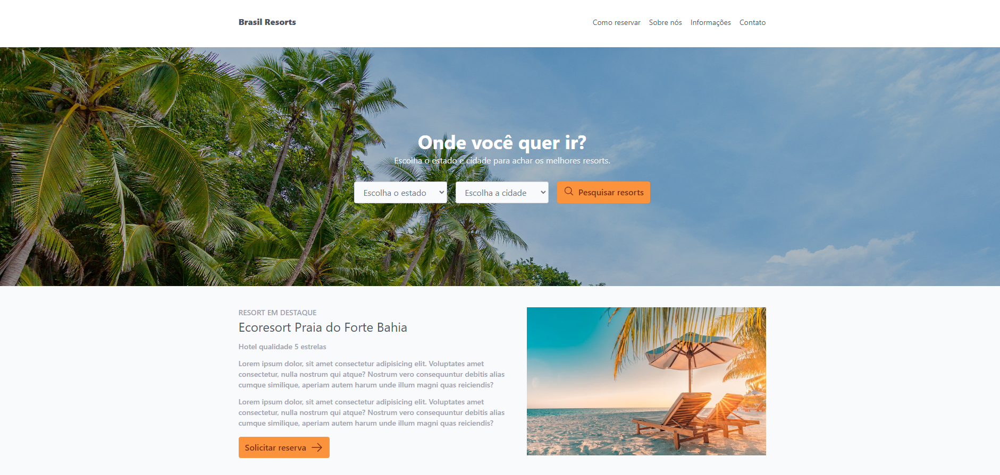

# Brasil Resorts



Este repositório contém o código-fonte do site **Brasil Resorts**, uma plataforma desenvolvida para explorar resorts no Brasil com base em estados e municípios. O site oferece uma experiência de usuário intuitiva, construído utilizando a estrutura de estilo Tailwind CSS.

## Recursos

- **Responsivo:** Design adaptativo para proporcionar uma experiência consistente em diferentes dispositivos.
- **Design Atraente:** Interface intuitiva e atraente, facilitando a navegação.
- **Tailwind CSS:** Desenvolvido com Tailwind CSS para um desenvolvimento eficiente e fácil manutenção.

## Pré-requisitos

Certifique-se de ter o [Node.js](https://nodejs.org/) instalado em sua máquina para executar o projeto localmente.

## Instalação

1. **Clone este repositório:**

    ```bash
    git clone https://github.com/seu-usuario/Brasil-Resorts.git
    ```

2. **Navegue até o diretório do projeto:**

    ```bash
    cd Brasil-Resorts
    ```

3. **Instale as dependências:**

    ```bash
    npm install
    ```

4. **Execute o projeto:**

    ```bash
    npm start
    ```
   
Certifique-se de ter o [Node.js](https://nodejs.org/) instalado em sua máquina para executar o projeto localmente.


